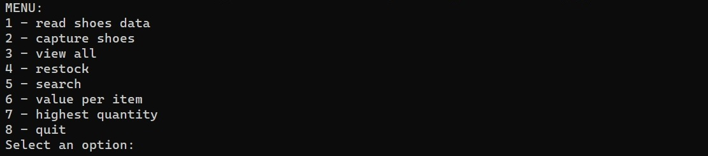
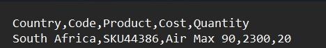

# Inventory

## Table Of Contents

* [Description](#description)
* [Installation](#installation)
* [Usage](#usage)
* [Database](#database)
* [Contributors](#contributors)

## Description

The program is to be used by a shoe store manager, who is responsible for managing the warehouse, and more importantly, doing stock taking.  
  
Other store managers of the company in other regions can also use this program. To optimise their delivery time and for improved organisation, this program will help to:
* Get an overview of all warehouse items, 
* Capture stock, 
* Search products by code.
* Determine the product with the lowest quantity and restock it.
* Determine the product with the highest quantity.
* Calculate the total value of each stock item. The total value is calculated by
multiplying the cost by the quantity for each item entered into the system.  
  
The program is designed and written in Python, using object-oriented programming (OOP), and a series of methods and functions.

## Installation

Download the inventory.py and inventory.txt (clone the repository) to your local machine, and place them in **the same folder**.  
  
To run the program, open your command line, navigate to a directory where you saved the files and type the following command in the command line:
'''
python inventory.py
''' 
  
Make sure you have Python installed on your PC, as well as the tabulate module, on your machine.
Instructions here: 
* [Python]( https://www.python.org/downloads/) 
* [python-tabulate]( https://pypi.org/project/tabulate/)

## Usage

When the program is started, the main menu will be displayed in order for a user to choose from the options provided.  
  
  
  
  
The program performs an action after a user selects an option and enters a corresponding number:  
  
1 – read shoe data: allows to read data from a file  
  
  
  
  
2 – capture shoes: allows to add new data about a shoe  
  
  
  
  
3 – view all:  allows to see the information in your shoe inventory - data is returned organised using Python's tabulate module  
  
  
  
  
4 – restock: lets you see and restock the shoes with the lowest quantity - asks you to enter the amount of additional stock for this product  
  
  
  
  
5 – search: lets you search for information about a shoe by code, and returns the other attributes  
  
  
  
  
6 – value per item: allows you to find out the total value for each item  
  
  
  
  
7 – highest quantity: lets you see the shoes with the highest quantity  
  

## Database

Text-file inventory.txt is used as a database.  
  
The program opens and reads from the inventory.txt file that contains the following attributes about shoe stock: Country, Code, Product, Cost, Quantity, and Value. All the information about each shoe object is stored in the inventory.txt file as a list.  
  
The data in the file is stored in the following format:  
  

## Contributors

[Nataliia Fedorets](https://github.com/NataliiaFed)(project owner)